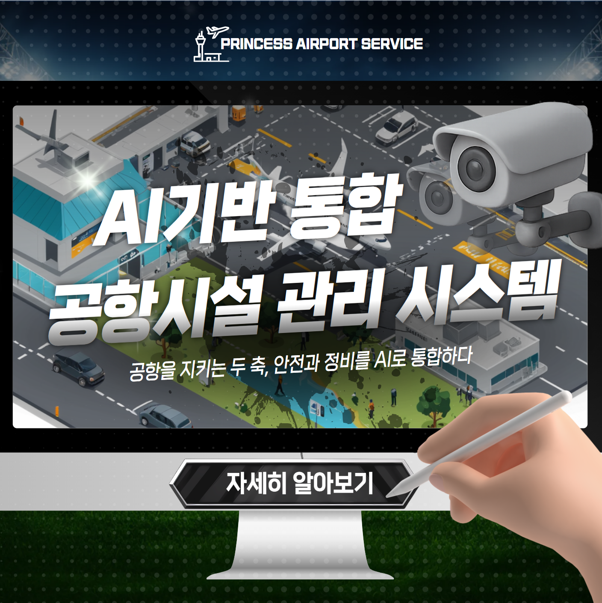

<h1 align="center">✈️ AI 기반 통합 공항시설 관리 시스템</h1>

<b>공항 안전과 유지보수를 자동화하는 스마트 솔루션
실시간 이상 탐지부터 수리 예측, 보고서 자동생성까지 한 번에</b>

  

## 👥 팀원을 소개합니다

<table>
  <tr>
    <td align="center"> <b>김민욱</b> 팀원</td>
    <td align="center"> <b>남강민</b> 팀장</td>
    <td align="center"> <b>문승환</b> 팀원</td>
    <td align="center"> <b>진예나</b> 팀원</td>
    <td align="center"> <b>최재윤</b> 팀원</td>
   <td align="center"> <b>허진수</b> 팀원</td>
  </tr>
</table>

---
## 🛫 프로젝트 배경
최근 무안공항 참사 등, 국내 공항에서의 안전사고가 꾸준히 발생하고 있습니다.
하지만 인력과 예산이 부족한 지방공항의 경우, 고비용의 시설관리 시스템을 도입하기 어려워 사고 대응의 공백이 존재합니다.

인천국제공항은 고도화된 FOD 탐지 시스템과 통합 시설관리 시스템을 갖추고 있지만,
지방공항은 초기 구축 비용, 유지보수 인력, 운영 비용의 부담으로 같은 수준의 시스템을 도입하기 어려운 상황입니다.

이에 따라 “지방공항에서도 도입 가능한 저비용, 고효율의 AI 기반 통합 시스템”의 필요성을 절감하게 되었고,
자동화된 탐지, 예측, 보고 시스템을 통해 운영 효율을 극대화하는 방향으로 프로젝트를 기획하게 되었습니다.

## 🗂️ 프로젝트 소개

이에 따라 “지방공항에서도 도입 가능한 저비용, 고효율의 AI 기반 통합 시스템”의 필요성을 절감하게 되었고,
자동화된 탐지, 예측, 보고 시스템을 통해 운영 효율을 극대화하는 방향으로 프로젝트를 기획하게 되었습니다.
프로젝트는 AI를 기반으로 공항의 시설 위험 요소를 자동으로 탐지하고,  
이상 상황에 대해 수리비용 및 기간을 예측, 이후 보고서까지 자동으로 생성하는 올인원(All-in-one) 공항시설 관리 솔루션입니다.  
지방공항도 쉽게 도입 가능하도록  
✅ 기존 인프라 재활용  
✅ 인력 최소화  
✅ 유지보수 비용 절감을 고려해 설계하였습니다.

---

## 🚀 주요 기능

| 기능 | 설명 |
|------|------|
| 🛰️ **이상 객체 탐지** | FOD/조류/차량/인물 등 실시간 탐지 및 맞춤형 경고, 관련 부서 자동 호출 |
| 🛠️ **활주로 손상 탐지 및 보고서 생성** | 균열 탐지 → 수리비용·기간 예측 → 보고서 자동 생성 (LLM 기반) |
| 🧾 **장비 유지보수 분석 및 보고서 생성** | 장비 상태 기반 유지/폐기/신규 판단 및 보고서 생성 |
| 🖥️ **통합 모니터링 대시보드** | 공항 지도, CCTV 스트리밍, 날씨 API, 알림 로그, 이상 탐지 로그 제공 |

  

---

## 📸 링크
- [서비스 바로가기](https://airportcopy27-h6d3g9g8e6aah6f3.z01.azurefd.net/)
- [관련 자료](https://www.canva.com/design/DAGwwNbYXQQ/meQ64MBZQNk1bcT6cnMEBw/edit?utm_content=DAGwwNbYXQQ&utm_campaign=designshare&utm_medium=link2&utm_source=sharebutton)

---

## 🪄 기술 스택

### ​ 🧠AI 모델링

### ​ 📚AI Frameworks & Libraries

### ​ 📝LLM

### ​​ 🖥️Front-End

### ​​ ⚙️Back-End

### ​📦인프라

### ​🗃️​ Database

